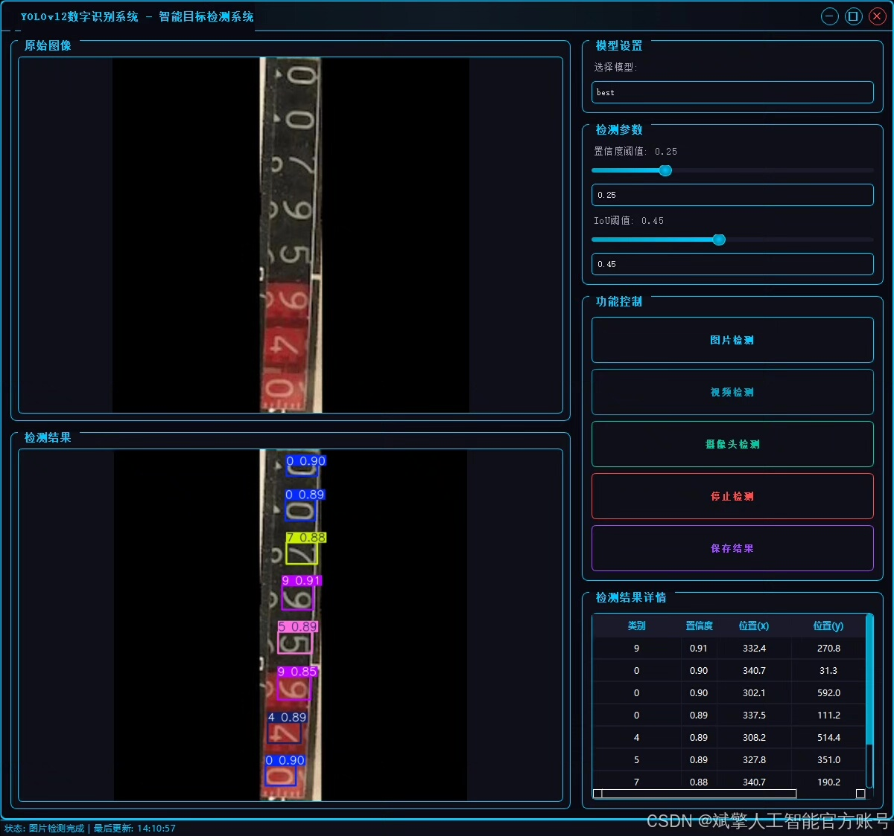
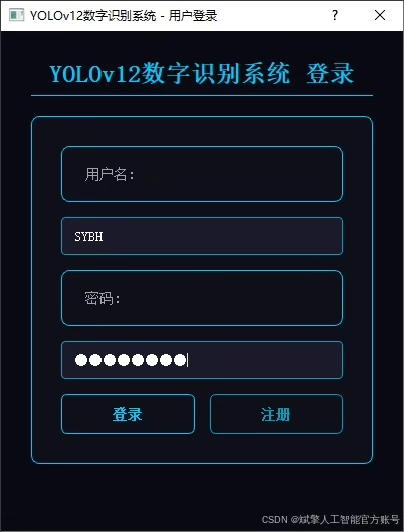
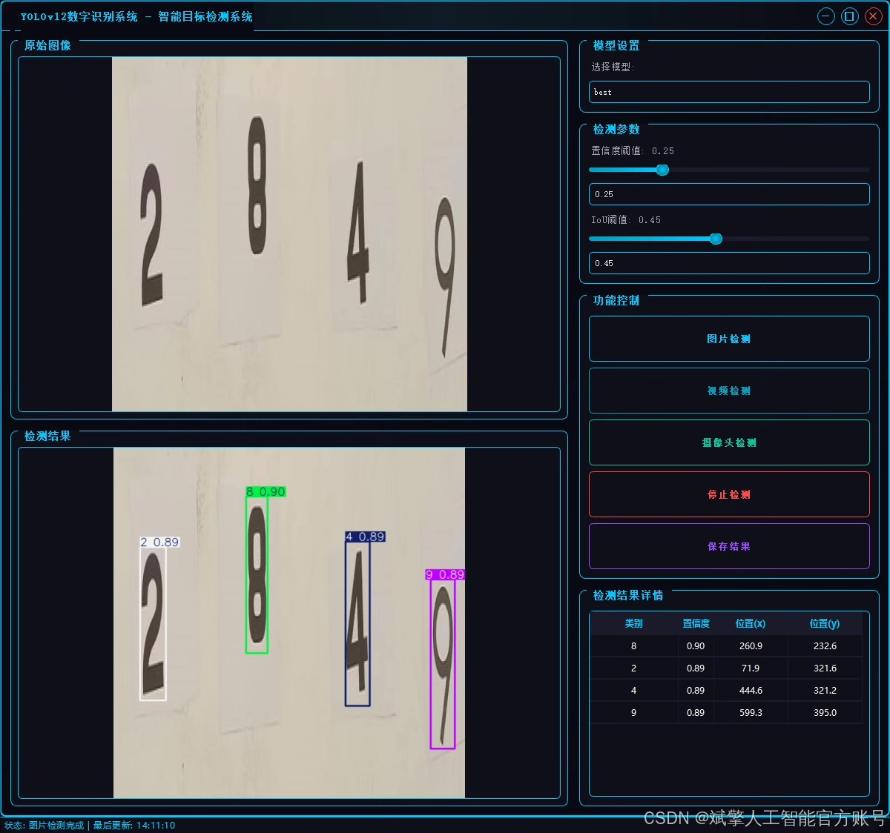
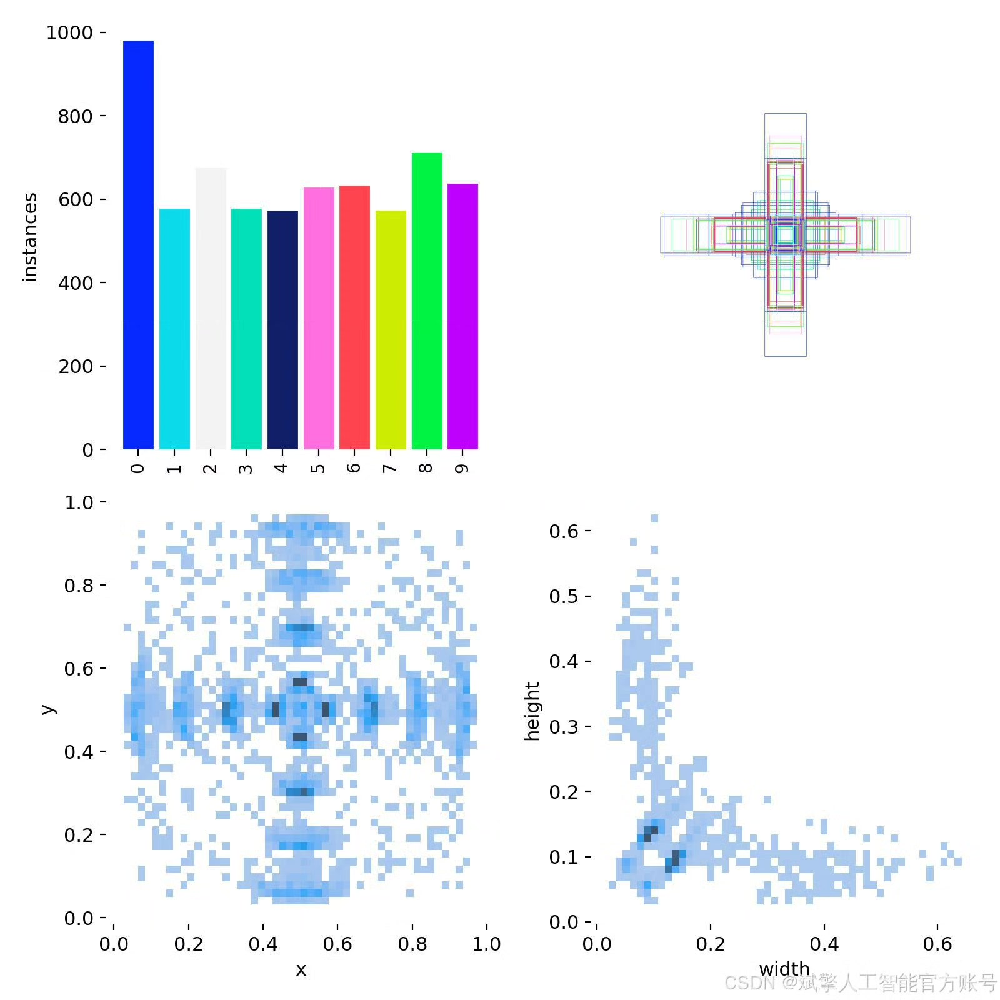
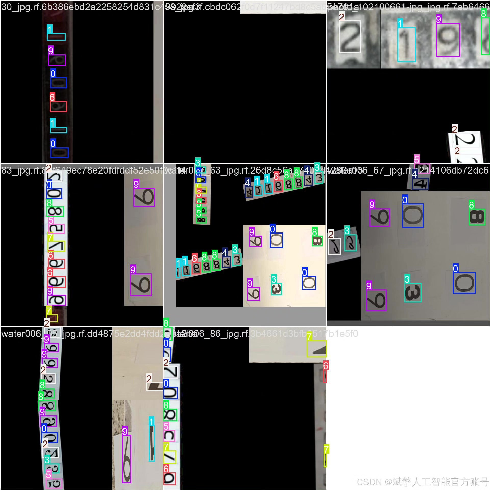
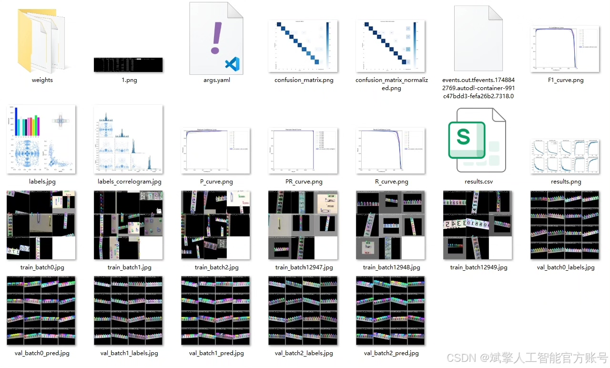
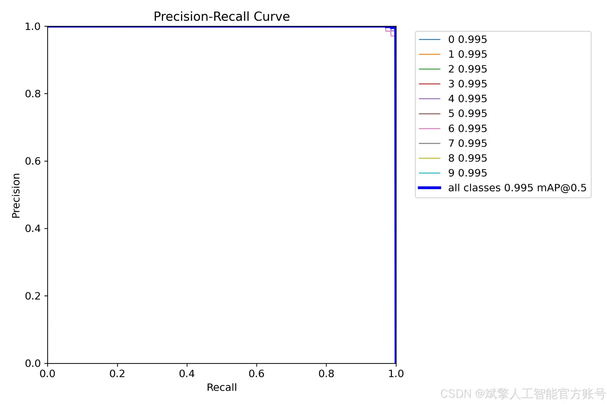
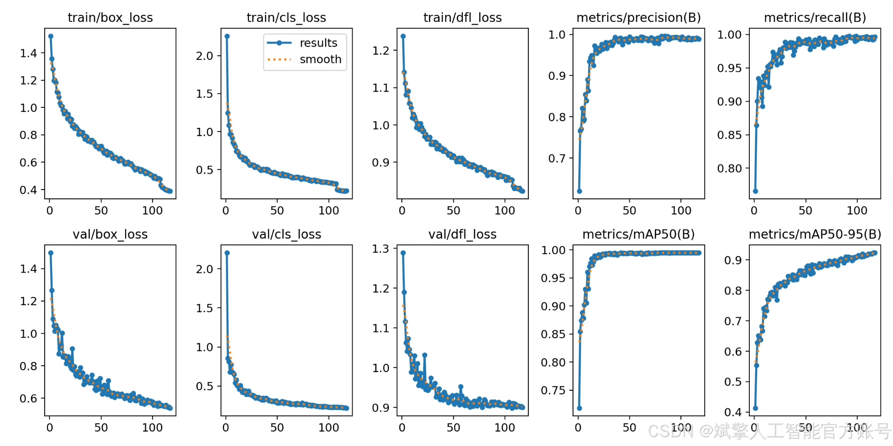
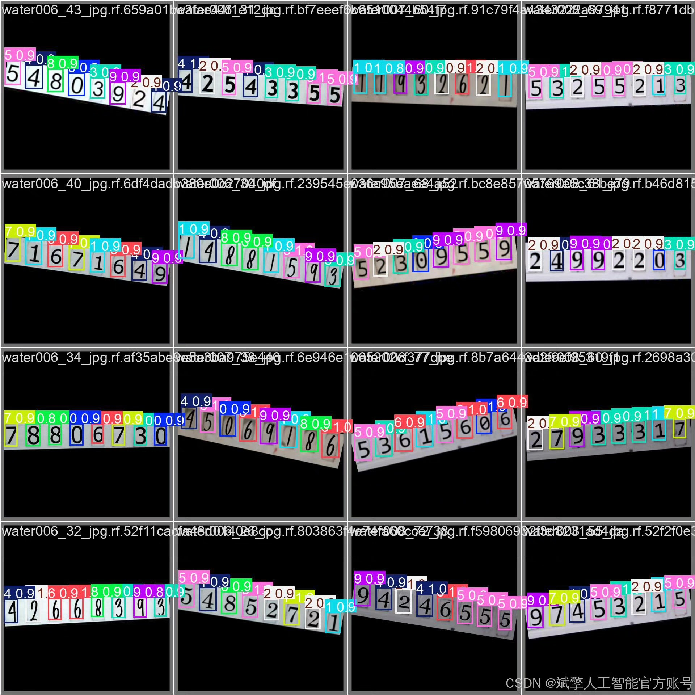

# YOLOv12-based digital recognition detection system based on deep learning

## Body

This project is based on the advanced deep learning object detection algorithm YOLOv12 to build an efficient and precise digital recognition detection system. It is suitable for various scenarios of digital recognition needs. The system supports real-time detection of 10 categories of numbers (0-9), with strong robustness, fast recognition speed, and high accuracy. The project adopts modular design, integrating YOLOv12 model training and inference, user-friendly UI interface, complete login registration function, and full dataset management, providing a one-stop solution from data preparation to model deployment. The system is developed in Python language, combined with PyTorch framework to implement model training, ensuring code extensibility and maintainability. In addition, the project provides rich datasets (including training set, validation set, and test set), and after rigorous data enhancement and annotation processing, provides high-quality data support for model training. This system can be widely used in actual scenes such as license plate recognition, industrial quality inspection, document digitization, etc., providing reliable technical support for digital recognition tasks.

Dataset:
nc: 10 classes,
name: ['0', '1', '2', '3', '4', '5', '6', '7', '8', '9'],
dataset quantity: training set 966, validation set 99, test set 50.

✅ User login registration: Support password detection and security verification.
✅ Three detection modes: Based on YOLOv12 model, support image, video, and real-time camera three detection, accurate target recognition.
✅ Dual screen comparison: Display original picture and detection results on the same screen.
✅ Data visualization: Real-time table displaying detection targets' category, confidence, and coordinates.
✅ Intelligent parameter adjustment: Provide confidence slide bar, dynamically optimize detection accuracy, adapt to different scene requirements.
✅ Sci-fi style interactive interface: Dark theme combined with dynamic light effects, reducing visual fatigue, improving operation experience.

## Images

## Payment

Here is a pay link on Stripe ( https://buy.stripe.com/3cs8yP7sY87d0vu9AB ). Please contact me lonlonago@foxmail.com after funding $89, and I will send you a complete data files , thank you!

